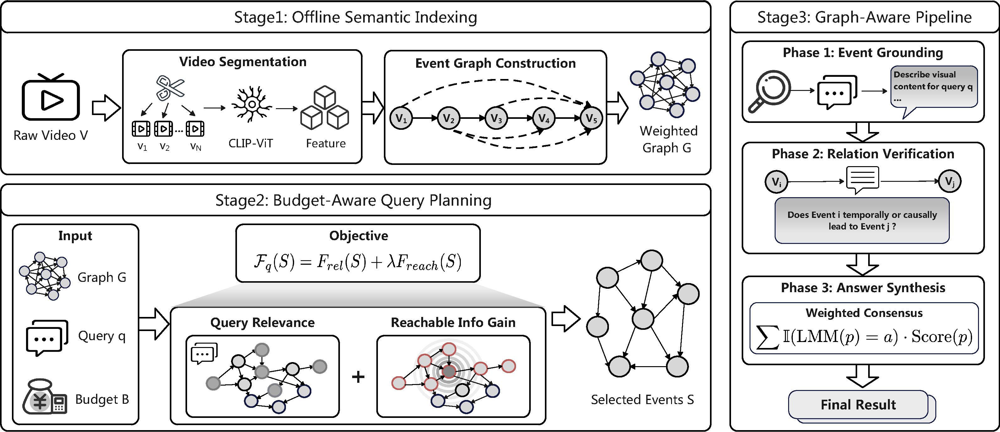

<div align="center">

<h1>BASS: Budget-Aware Subgraph Selection for<br>LMM-Based Long-Video Query Processing</h1>

Yuhao Deng<sup>1</sup>, Hanqing Hu<sup>1</sup>, Kun He<sup>2</sup>, Feicheng Li<sup>3</sup>, Qiyan Deng<sup>1</sup>, Lianpeng Qiao<sup>1</sup>,<br>
Yuping Wang<sup>1</sup>, Aoqian Zhang<sup>1</sup>, Ye Yuan<sup>1</sup>, Chengliang Chai<sup>1</sup>

<sup>1</sup>Beijing Institute of Technology &nbsp;&nbsp; <sup>2</sup>Renmin University of China &nbsp;&nbsp; <sup>3</sup>Baidu

<p>
  
  
  
  
</p>

<p>
  <a href="#-overview">Overview</a> •
  <a href="#-main-results">Results</a> •
  <a href="#-installation">Installation</a> •
  <a href="#-data-preparation">Data</a> •
  <a href="#-quick-start">Quick Start</a> •
  <a href="#-reproducing-the-paper">Reproduction</a> •
  <a href="#-citation">Citation</a>
</p>

</div>

<p align="center">
  
</p>

BASS treats a long video as a *queryable event graph* instead of a flat sequence of visual tokens. It builds a reusable graph index offline, selects a budget-feasible subgraph per query by maximizing a monotone submodular objective, and executes the query along verified graph relations. Under the same budget of 8,192 visual tokens, BASS reaches the highest average accuracy among the evaluated token-efficient methods, and it uses over 90% fewer visual tokens than full-sequence inference.

## News

- **[2026-09]** Code for BASS is released.

## Contents

- [Overview](#-overview)
- [Main Results](#-main-results)
- [Installation](#-installation)
- [Data Preparation](#-data-preparation)
- [Quick Start](#-quick-start)
- [Reproducing the Paper](#-reproducing-the-paper)
- [Code Structure](#-code-structure)
- [Citation](#-citation)
- [Acknowledgements](#-acknowledgements)

## 🔍 Overview

Answering open-ended queries such as *"What led to the arrest of the real perpetrator?"* over a long video requires connecting evidence scattered across distant moments. Feeding the whole video to a large multimodal model (LMM) costs hundreds of thousands of visual tokens. Keeping only the frames most similar to the query may drop *bridging* events that are individually less salient but necessary for multi-hop reasoning.

BASS is a **training-free data access and query planning framework** for LMM-based long-video query processing. It has three stages:

| Stage | What it does | Key techniques |
| :--- | :--- | :--- |
| **1. Offline semantic indexing** | Partitions each video into events and builds a directed weighted *event graph* once per video | Shot segmentation, multi-granular CLIP features, vector quantization, inverted index with inverse-event-frequency weighting, sparse similarity join |
| **2. Budget-aware query planning** | Selects an event set whose visual-token cost fits the budget B | Monotone submodular objective F<sub>q</sub>(S) = F<sub>rel</sub>(S) + λ·F<sub>reach</sub>(S) with Personalized PageRank reachability; cost-aware lazy greedy (CELF-style) selection |
| **3. Graph-guided execution** | Answers the query over the selected subgraph | Event grounding → relation verification → weighted voting over reasoning paths |

**Highlights**

- **Reusable index.** The event graph is query-independent. It is built once per video and shared by all of the video's queries, so the offline cost is amortized.
- **Sub-quadratic graph construction.** Semantic edges are found through an inverted index over visual words. In the paper this gives a 34× speedup over dense pairwise patch matching.
- **Principled selection.** The planning objective is provably monotone and submodular, and each event is charged its exact visual-token cost.
- **Model-agnostic.** No training or fine-tuning is needed. BASS works with open-source backbones (Qwen2.5-VL-7B, Qwen2-VL-72B) and proprietary ones (GPT-4o, Gemini 1.5 Pro).

## 📊 Main Results

Accuracy (%) of visual-token-efficient methods under a budget of **8,192 visual tokens** (Table 1 of the paper).

| Method | Type | Qwen2.5-VL-7B<br>VideoMME / VRBench / CinePile / **Avg.** | Qwen2-VL-72B<br>VideoMME / VRBench / CinePile / **Avg.** |
| :--- | :--- | :---: | :---: |
| FastV | Token reduction | 52.3 / 43.1 / 38.4 / 44.6 | 56.5 / 45.5 / 41.6 / 47.9 |
| DyCoke | Token reduction | 51.8 / 47.2 / 37.1 / 45.4 | 57.9 / 46.8 / 39.8 / 48.2 |
| VTR-VLM | Token reduction | 54.1 / 53.3 / 44.5 / 50.6 | 58.2 / 55.4 / 45.5 / 53.0 |
| AdaReTaKe | Token reduction | 50.8 / 47.1 / 46.4 / 48.1 | 55.5 / 48.2 / 48.0 / 50.6 |
| Q-Frame | Keyframe sampling | 53.5 / 48.5 / 40.7 / 47.6 | 62.0 / 52.1 / 41.9 / 52.0 |
| Nar-KFC | Keyframe sampling | 56.7 / 53.5 / 45.7 / 52.0 | 63.2 / 56.1 / 48.9 / 56.1 |
| MovieChat | Memory-based | 48.5 / 35.0 / 28.0 / 37.2 | 52.1 / 37.5 / 28.5 / 39.4 |
| SGVC | Caption-based | 45.0 / 32.0 / 30.2 / 35.7 | 49.5 / 34.8 / 31.1 / 38.5 |
| **BASS (Ours)** | **Graph-based** | **61.5 / 54.8 / 48.1 / 54.8** | **69.2 / 58.5 / 51.3 / 59.7** |

<details>
<summary><b>Full-sequence references</b> (no visual-token budget)</summary>

| Model | VideoMME | VRBench | CinePile | Avg. |
| :--- | ---: | ---: | ---: | ---: |
| Gemini 1.5 Pro | 75.0 | 70.7 | 60.1 | 68.6 |
| GPT-4o | 71.9 | 68.7 | 56.1 | 65.6 |
| InternVL2.5-78B | 72.1 | 53.5 | 54.6 | 60.1 |
| Qwen2-VL-72B | 71.2 | 59.1 | 54.2 | 61.5 |
| Qwen2.5-VL-7B | 65.1 | 56.5 | 52.6 | 58.1 |
| LLaVA-NeXT-34B | 70.6 | 48.5 | 41.5 | 53.5 |

</details>

<details>
<summary><b>Efficiency on VRBench</b> (Qwen2.5-VL-7B, 1.6 h videos, 9.37 queries per video; Table 5)</summary>

| Method | Offline (s/video) | Online (s/query) | Overall (s/video) | Accuracy (%) |
| :--- | ---: | ---: | ---: | ---: |
| Full-sequence | – | 87.2 | 817.1 | 56.5 |
| FastV | – | 65.4 | 612.8 | 43.1 |
| Q-Frame | – | 93.5 | 876.1 | 48.5 |
| AdaReTaKe | 108.2 | 17.3 | 270.3 | 47.1 |
| VTR-VLM | 147.4 | 13.5 | 273.9 | 53.3 |
| **BASS** | **40.0** | **6.5** | **100.9** | **54.8** |

</details>

## 🛠 Installation

```bash
git clone https://github.com/ddengyuhao/BASS.git
cd BASS

conda create -n bass python=3.10 -y
conda activate bass
pip install -r requirements.txt

# (Optional) FlashAttention-2 for faster inference
pip install flash-attn --no-build-isolation

# (Optional) proprietary backbones used in Table 4
pip install openai google-genai
```

Model weights are pulled from the HuggingFace Hub on first use:

| Component | Checkpoint |
| :--- | :--- |
| LMM backbone (7B) | [`Qwen/Qwen2.5-VL-7B-Instruct`](https://huggingface.co/Qwen/Qwen2.5-VL-7B-Instruct) |
| LMM backbone (72B) | [`Qwen/Qwen2-VL-72B-Instruct`](https://huggingface.co/Qwen/Qwen2-VL-72B-Instruct) |
| Proprietary backbones | GPT-4o (`gpt-4o-2024-05-13`, requires `OPENAI_API_KEY`), Gemini 1.5 Pro (`gemini-1.5-pro`, requires `GEMINI_API_KEY`) |
| Vision encoder | [`openai/clip-vit-large-patch14`](https://huggingface.co/openai/clip-vit-large-patch14) |
| Shot detector | [TransNetV2](https://github.com/soCzech/TransNetV2) (via `transnetv2-pytorch`) |

Use `--model_path` and `--clip_path` to load local checkpoints instead; for the API backbones, `--model_path` selects the model version. All experiments in the paper were run on 4× NVIDIA A100 (40GB).

## 📁 Data Preparation

```text
dataset/
├── VideoMME/
│   └── videos/{videoID}.mp4
├── VRBench/
│   ├── VRBench_eval.jsonl
│   └── videos/{video_id}.mp4
└── CinePile/
    ├── yt_videos/            # filled automatically
    └── cookies.txt           # optional, for yt-dlp
```

| Benchmark | Source | Scale | Notes |
| :--- | :--- | :--- | :--- |
| Video-MME | [lmms-lab/Video-MME](https://huggingface.co/datasets/lmms-lab/Video-MME) | 900 videos, 2,700 QA | Annotations load from the Hub; place videos in `VideoMME/videos/`, named by `videoID` |
| VRBench | [OpenGVLab/VRBench](https://huggingface.co/datasets/OpenGVLab/VRBench) | 1,010 videos (avg. 1.6 h), 9,468 QA | Download `VRBench_eval.jsonl` and extract the video archives into `VRBench/videos/` |
| CinePile | [tomg-group-umd/cinepile](https://huggingface.co/datasets/tomg-group-umd/cinepile) | 9,396 clips | Annotations load from the Hub; clips are downloaded with `yt-dlp` on first access |

## 🚀 Quick Start

Evaluate BASS with Qwen2.5-VL-7B on Video-MME on 4 GPUs:

```bash
DATASET=VideoMME BACKBONE=Qwen2.5-VL-7B bash scripts/run.sh
```

This writes results to `results/VideoMME_Qwen2.5-VL-7B_B8192/` and prints accuracy, visual tokens per query, and latency. `run.sh` accepts the environment variables `DATASET`, `BACKBONE`, `TOKEN_BUDGET`, `GPU_IDS`, `DATA_ROOT`, `MODEL_PATH`, and `CLIP_PATH`. Any extra argument is forwarded to `scripts/run_inference.py`.

Single-process evaluation:

```bash
python scripts/run_inference.py --dataset VRBench --backbone Qwen2.5-VL-7B \
    --token_budget 8192 --output_dir results/vrbench_7b
python scripts/merge_results.py results/vrbench_7b
```

<details>
<summary><b>All hyperparameters</b></summary>

| Argument | Default | Paper | Description |
| :--- | :--- | :--- | :--- |
| `--token_budget` | 8192 | B | Visual-token budget |
| `--delta` | 0.65 | δ | Similarity threshold for semantic edges |
| `--lambda_param` | 1.0 | λ | Weight of reachable information gain F<sub>reach</sub> |
| `--alpha` | 0.15 | α | Restart probability of Personalized PageRank |
| `--vocab_size` | 1024 | \|𝒲\| | Size of the visual-word vocabulary |
| `--rho` | 50 | ρ | Posting-list cap; more frequent visual words are dropped as stop words |
| `--frame_interval` | 4.0 | – | One representative frame per this many seconds of an event |
| `--max_frames_per_event` | 4 | – | Upper bound on representative frames m<sub>i</sub> per event |
| `--frame_size` | 336 | – | Frame resolution fed to the LMM (144 visual tokens per frame) |
| `--max_paths` | 8 | – | Maximum reasoning paths used in result synthesis |
| `--max_new_tokens` | 512 | – | Maximum generation length per LMM call (greedy decoding) |
| `--segmentation` | `transnetv2` | – | `transnetv2` \| `pyscenedetect` \| `uniform` \| `precomputed` |
| `--boundary_dir` | – | – | Event boundaries from an external segmenter, one `<video name>.json` per video containing `[[start_sec, end_sec], ...]` |

</details>

<details>
<summary><b>Output format</b></summary>

Every query is stored with the full execution trace:

```json
{
  "id": "001-1",
  "pred": "C",
  "gt": "C",
  "raw_response": "The answer is C.",
  "trace": {
    "selected": [3, 7, 12],
    "records": {"3": "...", "7": "...", "12": "..."},
    "verified_edges": [[3, 12, "The same painting appears in both events."]],
    "rejected_edges": [],
    "paths": [{"path": [3, 12], "score": 0.71, "answer": "C"}],
    "votes": {"C": 0.71},
    "visual_tokens": 1728.0,
    "num_events": 41,
    "offline_time": 38.2,
    "online_time": 6.1
  }
}
```

`offline_time` is non-zero only for the first query of each video, which is when the event graph is built.

</details>

## 🧪 Reproducing the Paper

Each experiment in Sec. 5 maps to the command below. `{a,b,...}` means one run per value. Each setting is written to its own directory under `results/`.

| Paper | Experiment | Command |
| :--- | :--- | :--- |
| Table 1 | Main results | `DATASET={VideoMME,VRBench,CinePile} BACKBONE={Qwen2.5-VL-7B,Qwen2-VL-72B} bash scripts/run.sh` |
| Fig. 3 | w/o query relevance F<sub>rel</sub> | `bash scripts/run.sh --disable_relevance` |
| Fig. 4 | w/o reachable information gain F<sub>reach</sub> | `bash scripts/run.sh --lambda_param 0` |
| Fig. 5 | Cost-feasible random selection | `bash scripts/run.sh --planner random` |
| Fig. 6 | Standard CoT instead of graph-guided execution | `bash scripts/run.sh --execution cot` |
| Table 2 | Segmentation strategies | `bash scripts/run.sh --segmentation {uniform,pyscenedetect,transnetv2}` |
| Table 2 | UBoCo segmentation | run [UBoCo](https://arxiv.org/abs/2111.14799) and export its boundaries, then `bash scripts/run.sh --segmentation precomputed --boundary_dir <dir>` |
| Table 3 | Pairwise matching (PM) | `bash scripts/run.sh --edge_construction pairwise` |
| Table 3 | BASS w/o weighting | `bash scripts/run.sh --uniform_word_weight` |
| Fig. 7(a) | Sensitivity to λ | `bash scripts/run.sh --lambda_param {0,0.5,1.0,1.5,2.0}` |
| Fig. 7(b) | Sensitivity to δ | `bash scripts/run.sh --delta {0.5,0.6,0.65,0.7,0.8}` |
| Table 4 | Proprietary LMMs with BASS | `BACKBONE={GPT-4o,Gemini-1.5-Pro} bash scripts/run.sh` |
| Table 4 | Proprietary LMMs with uniform sampling | `BACKBONE={GPT-4o,Gemini-1.5-Pro} bash scripts/run.sh --method Uniform` |
| Fig. 8 | Accuracy vs. visual-token budget | `TOKEN_BUDGET={1024,2048,4096,8192,12288} bash scripts/run.sh` |
| Table 5 | Offline / online latency | printed by `scripts/merge_results.py` |

The token-efficient baselines in Table 1 and Table 5 are evaluated with their official implementations under the same visual-token budget.

## 🧩 Code Structure

```text
BASS/
├── bass/
│   ├── methods/
│   │   ├── bass_method.py    # End-to-end pipeline: offline index + online execution
│   │   ├── segmentation.py   # Event segmentation (TransNetV2 / PySceneDetect / uniform)
│   │   ├── graph_builder.py  # Visual vocabulary, inverted index, semantic edges, PPR
│   │   ├── celf_solver.py    # Cost-aware lazy greedy planner
│   │   ├── execution.py      # Graph-guided execution pipeline
│   │   └── uniform_sampling.py  # Uniform-sampling baseline (Table 4)
│   ├── models/               # Qwen2.5-VL-7B / Qwen2-VL-72B / GPT-4o / Gemini backbones
│   ├── data/                 # Video-MME / VRBench / CinePile loaders
│   └── utils.py
├── scripts/
│   ├── run.sh                # Multi-GPU evaluation
│   ├── run_inference.py      # Evaluation entry point
│   └── merge_results.py      # Accuracy, visual tokens, and latency
└── assets/
```

<details>
<summary><b>Paper-to-code correspondence</b></summary>

| Paper | Component | Code |
| :--- | :--- | :--- |
| Sec. 2.1, Eq. (1) | Budget-constrained selection, event cost c<sub>i</sub> | [`BASS.build_index`](bass/methods/bass_method.py) |
| Sec. 3 | Event segmentation | [`segmentation.py`](bass/methods/segmentation.py) |
| Sec. 3, Eq. (2) | Global features x<sub>i</sub><sup>g</sup>, local patches X<sub>i</sub><sup>p</sup> | [`BASS._extract_event_features`](bass/methods/bass_method.py) |
| Sec. 3, Eq. (3) | Dense pairwise patch matching | [`compute_semantic_edges_pairwise`](bass/methods/graph_builder.py) |
| Sec. 3, Eq. (4)–(5) | Vector quantization, inverted index, IEF weights, stop-word cap ρ, sparse join | [`build_visual_vocabulary`, `build_inverted_index`, `compute_semantic_edges`](bass/methods/graph_builder.py) |
| Sec. 3, Eq. (6) | Temporal edges | [`build_adjacency`](bass/methods/graph_builder.py) |
| Sec. 4.1, Eq. (7) | Reachability matrix Π | [`compute_pagerank_matrix`](bass/methods/graph_builder.py) |
| Sec. 4.1, Eq. (8)–(9) | F<sub>rel</sub>, F<sub>reach</sub>, unified objective | [`CELFSelector`](bass/methods/celf_solver.py) |
| Sec. 4.1, Alg. 1 | Cost-aware lazy greedy planning | [`CELFSelector.select`](bass/methods/celf_solver.py) |
| Sec. 4.2, Phase 1–2 | Event grounding, relation verification | [`GraphGuidedExecutor.run`](bass/methods/execution.py) |
| Sec. 4.2, Phase 3, Eq. (10) | Reasoning paths and weighted aggregation | [`GraphGuidedExecutor._enumerate_paths`](bass/methods/execution.py) |

</details>

## 📝 Citation

If you find BASS useful in your research, please consider citing:

```bibtex
@misc{deng2026bass,
  title  = {BASS: Budget-Aware Subgraph Selection for LMM-Based Long-Video Query Processing},
  author = {Deng, Yuhao and Hu, Hanqing and He, Kun and Li, Feicheng and Deng, Qiyan and
            Qiao, Lianpeng and Wang, Yuping and Zhang, Aoqian and Yuan, Ye and Chai, Chengliang},
  year   = {2026}
}
```

## 🙏 Acknowledgements

BASS builds on [Qwen2-VL / Qwen2.5-VL](https://github.com/QwenLM/Qwen2.5-VL), [CLIP](https://github.com/openai/CLIP), [TransNetV2](https://github.com/soCzech/TransNetV2), and [PySceneDetect](https://github.com/Breakthrough/PySceneDetect). We thank the authors of [Video-MME](https://github.com/BradyFU/Video-MME), [VRBench](https://huggingface.co/datasets/OpenGVLab/VRBench), and [CinePile](https://huggingface.co/datasets/tomg-group-umd/cinepile) for releasing their benchmarks.
